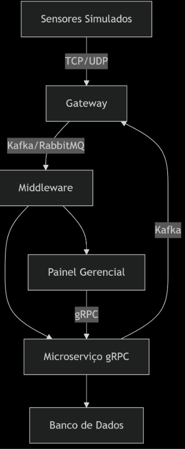

# Documentação Técnica do Sistema SmartCampus Solutions
Versão 1.0
Data: 25/04/2024

## 1. Visão Geral
### 1.1 Objetivos
Monitorar ambientes universitários em tempo real (salas, laboratórios, auditórios)

Controlar dispositivos IoT simulados (iluminação, ar-condicionado, segurança)

Processar dados distribuídos com garantia de escalabilidade e resiliência

### 1.2 Arquitetura
Diagrama de Arquitetura

## 2. Especificações Técnicas
### 2.1 Stack Tecnológica
Componente	Tecnologias
Comunicação	gRPC (v1.60.0), Socket TCP/UDP
Mensageria	Apache Kafka (v3.5.1) via Docker
Backend	Python (3.11+), Flask (3.0.2), Flask-SocketIO (5.3.6)
Frontend	HTML5, JavaScript (ES6+), Chart.js (para gráficos)
Ferramentas	Docker Desktop (4.26.1), pip (23.3.1), Protobuf (4.25.1)

## 3.2 Instalação

 ### 1. Clonar repositório
git clone https://github.com/seu-usuario/smart-campus.git
cd smart-campus

  ### 2. Configurar ambiente virtual
python -m venv .venv
source .venv/bin/activate  # Linux/Mac
.\.venv\Scripts\activate   # Windows

  ### 3. Instalar dependências
pip install -r requirements.txt

  ### 4. Iniciar Kafka via Docker
cd middleware/kafka
docker-compose up -d

  ### 5. Gerar stubs gRPC
cd microservices/storage_service
python -m grpc_tools.protoc -Iproto --python_out=. --grpc_python_out=. proto/storage.proto
## 4. Fluxo Operacional
### 4.1 Coleta de Dados
[Sensor Simulado] -(TCP)→ [Gateway] -(Kafka)→ [Microsserviço] → [Dashboard]
  (JSON)            |        (Avro)            (gRPC/Protobuf)  (WebSocket)
### 4.2 Controle de Dispositivos
[Dashboard] -(WebSocket)→ [Gateway] -(UDP)→ [Atuador Simulado]
  (JSON)       |            (Protobuf)        (Comandos binários)
## 5. Componentes Principais
### 5.1 Simulador de Sensores (sensor.py)
Estrutura de Mensagem:

`json
{
  "sensor_id": "temp_001",
  "type": "temperature",
  "value": 23.5,
  "timestamp": 1714060800.123456,
  "location": "BLOCK_A/ROOM_101"
}`

Parâmetros de Execução:

no bash 

`python sensor_simulator/sensor.py \
  --id sensor_001 \
  --type temperature \
  --interval 5 \
  --gateway localhost:65432`
### 5.2 Gateway de Comunicação (gateway.py)
Funcionalidades:

TCP Server: Porta 65432 (sensores)

UDP Client: Porta 65433 (atuadores)

Kafka Producer: Tópicos:

  - sensor-data (dados brutos)

  -  actuator-commands (controle)

 Métricas:

      python
      class GatewayMetrics:
          def __init__(self):
              self.messages_received = 0
              self.messages_forwarded = 0
              self.last_activity = datetime.now()
### 5.3 Microsserviço de Armazenamento (storage_service)
API gRPC:

    protobuf
    service StorageService {
      rpc StoreData(DataPacket) returns (StorageResponse);
      rpc RetrieveData(DataQuery) returns (stream DataPacket);
    }

    message DataPacket {
      string sensor_id = 1;
      bytes payload = 2;
      int64 timestamp = 3;
    }
Testando o Serviço:

No bash
- Iniciar servidor:

  ` python microservices/storage_service/server.py`

- Cliente de teste:

  `python microservices/storage_service/client.py \
    --operation retrieve \
    --sensor-id temp_001`
## 6. Interface Gerencial
### 6.1 Dashboard (dashboard/app.py)

WebSocket Events:

    // Recebendo atualizações
    socket.on('sensor_update', (data) => {
      updateDashboard(data);
    });

    // Enviando comandos
    function toggleLight(room) {
      socket.emit('control', {
        type: 'light_control',
        room: room
      });
    }
## 7. Testes e Validação
### 7.1 Testes Unitários
No bash
- Testar comunicação Socket
`python -m unittest test/test_socket_communication.py`

- Validar serialização Protobuf
`python -m unittest test/test_protobuf_serialization.py`
### 7.2 Teste de Carga

- Simular 100 sensores

      for i in range(100):
          SensorSimulator(
              sensor_id=f"sensor_{i}",
              sensor_type=random.choice(SENSOR_TYPES),
              interval=0.1
          ).start()
          
## 8. Troubleshooting
### 8.1 Erros Comuns
Erro	Causa Provável	Solução
Kafka connection timeout	Broker não iniciado	docker-compose restart kafka
gRPC channel closed	Servidor gRPC offline	Verificar storage_server.py
TemplateNotFound	Estrutura de pastas incorreta	Validar diretório templates/
### 8.2 Monitoramento
No bash
- Verificar tópicos Kafka
`docker exec -it kafka kafka-topics --list --bootstrap-server localhost:9092`

-  Monitorar mensagens

docker exec -it kafka kafka-console-consumer \
  --bootstrap-server localhost:9092 \
  --topic sensor-data \
  --from-beginning

